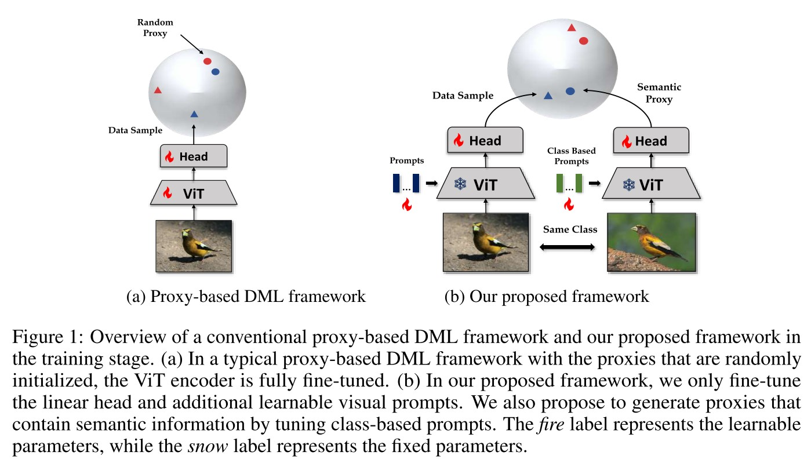

# ParameterEfficient Deep Metric Learning (DML)

Implementation of ICLR 2024 Paper: [Learning Semantic Proxies from Visual Prompts for Parameter-Efficient Fine-Tuning in Deep Metric Learning](https://arxiv.org/pdf/2402.02340.pdf)

Li Ren, Chen Chen, Liqiang Wang, Kien Hua

[](https://paperswithcode.com/sota/metric-learning-on-cub-200-2011?p=learning-semantic-proxies-from-visual-prompts)
[](https://paperswithcode.com/sota/metric-learning-on-cars196?p=learning-semantic-proxies-from-visual-prompts)
[](https://paperswithcode.com/sota/metric-learning-on-in-shop-1?p=learning-semantic-proxies-from-visual-prompts)
[](https://paperswithcode.com/sota/image-retrieval-on-inaturalist?p=learning-semantic-proxies-from-visual-prompts)

## Abstract 

Deep Metric Learning (DML) has long attracted the attention of the machine learning community as a key objective. Existing solutions concentrate on fine-tuning the pre-trained models on conventional image datasets. As a result of the success of recent pre-trained models trained from larger-scale datasets, it is challenging to adapt the model to the DML tasks in the local data domain while retaining the previously gained knowledge. In this paper, we investigate parameter-efficient methods for fine-tuning the pre-trained model for DML tasks. In particular, we propose a novel and effective framework based on learning Visual Prompts (VPT) in the pre-trained Vision Transformers (ViT). Based on the conventional proxy-based DML paradigm, we augment the proxy by incorporating the semantic information from the input image and the ViT, in which we optimize the visual prompts for each class. We demonstrate that our new approximations with semantic information are superior to representative capabilities, thereby improving metric learning performance. We conduct extensive experiments to demonstrate that our proposed framework is effective and efficient by evaluating popular DML benchmarks. In particular, we demonstrate that our fine-tuning method achieves comparable or even better performance than recent state-of-the-art full fine-tuning works of DML while tuning only a small percentage of total parameters.

## Framework




## Citation

If you find this repo useful, please consider citing:

```BibTex
@inproceedings{
  ren2024learning,
  title={Learning Semantic Proxies from Visual Prompts for Parameter-Efficient Fine-Tuning in Deep Metric Learning},
  author={Li Ren and Chen Chen and Liqiang Wang and Kien A. Hua},
  booktitle={The Twelfth International Conference on Learning Representations},
  year={2024},
  url={https://openreview.net/forum?id=TWVMVPx2wO}
}
```

## Suggested Enviroment

* PyTorch >= 1.12
* cudatoolkit >= 11.3
* torchvision >= 0.13
* timm == 0.9.16

## Suggested Installation

1. Properly install the [Anaconda](https://www.anaconda.com/download) or [Miniconda](https://repo.anaconda.com/miniconda/)
2. Prepare Conda enviroment with following script
   
   
```Bash
conda init
source ~/.bashrc
conda create --name dml python=3.8 -y
conda activate dml
```
1. Install CUDA and Pytorch with following script
```Bash
conda update -n base -c defaults conda -y
conda install -y pytorch=1.12.1=py3.8_cuda11.3_cudnn8.3.2_0 faiss-gpu torchvision cudatoolkit=11.3 -c pytorch 
conda install -c conda-forge timm=0.9.16 pretrainedmodels fairscale -y
pip install tqdm regex
```

## Download Data
**CUB200** can be downloaded from [here](https://www.dropbox.com/s/tjhf7fbxw5f9u0q/cub200.tar?dl=1) \
**CARS** can be downloaded from [here](https://www.dropbox.com/s/zi2o92hzqekbmef/cars196.tar?dl=1) \
**Stanford_Online_Products** can be downloaded from the [official webset](https://cvgl.stanford.edu/projects/lifted_struct/)\
**In-Shop Clothes Retrieval** can be downloaded from the [official webset](https://mmlab.ie.cuhk.edu.hk/projects/DeepFashion/InShopRetrieval.html)
**iNaturalist** can be downloaded from the [official webset](https://github.com/visipedia/inat_comp/tree/master/2017)

The datasets should be unpacked and placed in a distinct folder. An illustration of a data structure is as follows:

```Bash 
$HOME/data/
├── cars196
│   └── images
├── cub200
│   └── images
├── inshop
│   └── img
|   └── list_eval_partition.txt
├── sop
│   ├── images
│   └── Info_Files
├── inaturalist
│   ├── Inaturalist_train_set1.txt
│   ├── Inaturalist_test_set1.txt
|   └── train_val2018
```

## Training

Start to run the training procedure with following command:


```Bash
python main.py --source_path ${data_path} \
--config ${config_path} \
--gpu ${gpu_id}
```

**`data_path`** is the root of your dataset.\
**`config_path`** is the path of configure file that save specific hyper-parameters.\
**`gpu_id`** is the index of your GPU starting from 0


For example, to fine-tun a model based on ViT-S16, 

```Bash
# Train DADA on CUB200
python main.py --source_path ../dml_data \
--config ./configs/cub200_small.yaml \
--gpu 0
```

The pre-training model and other configs can be edited in `./configs/${your_setting}.yaml`


## Proposed Results in Table 2

Main results of our proposed **VPTSP-G** approach based on the pretrained model __ViT-S16__ and __ViT-B16__.

| ViT-S16/384   | R@1 | MAP@R     |
|---------- |-----------|---------|
| CUB       |   86.6   |   0.527  |
| Cars      |   87.7   |   0.289  |
| SOP       |   84.4   |   0.501  |
| InShop    |   91.2   |   --     |


| ViT-B16/512   | R@1 | MAP@R |
|----------|----------|----------|
| CUB     |    88.5   |   0.570  |
| Cars    |    91.2   |   0.350  |
| SOP     |    86.8   |   0.538  |
| InShop    |  92.5  |    --      |
| iNaturalist   |   84.5    |  0.481 |


Please note that the reproduced results may be different from the those reported in the paper due to different enviroments, the hardware architectures and uncontrollable randomnesses.

## Acknowledgement

This implementation is partially based on:

https://github.com/Confusezius/Deep-Metric-Learning-Baselines
https://github.com/Confusezius/Revisiting_Deep_Metric_Learning_PyTorch
